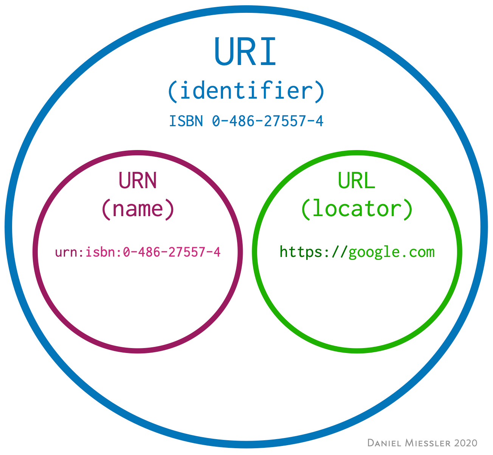

# URI 웹 브라우저 요청 흐름

## URI (Uniform Resource Identifier)

- 리소스를 식별하는 통합된 방법

> URI는 로케이터(locator), 이름(name) 또는 둘 다 추가로 분류될 수 있다.

> 

- URI라는 가장 큰 개념 (resource Identifier) → 리소스를 식별한다 (자원을 식별하는 방법)
- URL (Resource Locator) → 리소스의 위치
- URN (Resource Name) → 리소스의 이름

### URI의 단어 뜻

- Uniform: 리소스를 식별하는 통일된 방식
- Resource: 자원, URI로 식별할 수 있는 모든 것(제한 없음)
- Identifier: 다른 항목과 구분하는 데 필요한 정보

### URL, URN의 단어 뜻

- URL - Locator: 리소스가 있는 위치를 지정
- URN - Name: 리소스에 이름을 부여
- 위치는 변할 수 있지만, 이름은 변하지 않는다.
- URN 이름만으로 실제 리소스를 찾을 수 있는 방법이 보편화 되지 않음.

### URL의 전체 문법

- Scheme://[userInfo@]host[:port][/path][?query][#fragment]
- https://www.google.com:443/search?q=hello&hl=ko

- 프로토콜(https)
- 호스트명(www.google.com)
- 포트 번호(443)
- 패스(/search)
- 쿼리 파라미터(q=hello&hl=ko)

### Scheme

**Scheme://**[userInfo@]host[:port][/path][?query][#fragment]

- 주로 프로토콜 사용
- 프로토콜: 어떤 방식으로 자원에 접근할 것인가 하는 약속 규칙
    - 예) http, https, ftp 등등
- 포트는 생략가능, 프로토콜에 따라 자동적으로 할당되기 때문에

### userInfo

Scheme://**[userInfo@]**host[:port][/path][?query][#fragment]

- URL에 사용자정보를 포함해서 인증
- 거의 사용하지 않음

### host

Scheme://[userInfo@]**host**[:port][/path][?query][#fragment]

- 호스트명
- 도메인명 또는 IP 주소를 직접 사용가능

### PORT

Scheme://[userInfo@]host**[:port]**[/path][?query][#fragment]

- 포트 (PORT)
- 접속 포트
- 일반적으로 생략, 생략시는 http는 80, https는 443

### path

Scheme://[userInfo@]host[:port]**[/path]**[?query][#fragment]

- 리소스의 경로(path), 계층적 구조
- 예시
    - /root/file/file.png
    - /code

### query

Scheme://[userInfo@]host[:port][/path]**[?query]**[#fragment]

- key = value 형태
- ?로 시작, &로 추가 가능 ?key=valueA&keyB=valueB
- query parameter, query string 등으로 불림, 웹 서버에서 제공하는 파라미터, 문자 형태
- 숫자로 넘겨도 문자형태로 넘어가기 때문에 query string이라고 부름

fragment

Scheme://[userInfo@]host[:port][/path][?query]**[#fragment]**

- html 내부 북마크 등에 사용 됨
- 서버에 전송하는 정보 아님

## 웹 브라우저 요청 흐름

Scheme://[userInfo@]host[:port][/path][?query][#fragment]

1. host의 정보로 dns서버를 조회하여 IP를 수신 받음, 
scheme의 정보로 port번호를 알아냄 (혹은 직접 기입한 정보로 알아냄)
2. http 요청 메시지 생성
    1. 요청 메시지 예시
        
        GET /search?q=hello&hl=ko HTTP/1.1
        
        HOST: www.google.com
        
        GET /path?query http버전
        
        host정보
        
3. http 메시지 전송
    1. 생성된 메시지를 socket 라이브러리를 통해 전달
        1. A: TCP/IP 연결(IP, PORT) → 3 way handshaking을 통해서 가상 연결
        2. B: 데이터 전달
    2. TCP/IP 패킷 생성, HTTP 메시지 포함
    3. 네트워크 인터페이스를 통해 서버로 송신 → 수 많은 인터넷 망 노드를 통해 서버에서 수신
4. 서버에서 패킷 수신
    1. 수신 후, TCP/IP 정보를 전부 폐기
    2. http 메시지만 가져와 이를 분석함 (path, query로 어떠한 정보를 요청하는 지)
    3. HTTP 응답 메시지를 생성함.
5. 응답 패킷을 서버에서 송신, 클라이언트에서 수신
6. HTTP 응답 메시지를 웹 브라우저가 렌더링하고 웹 페이지에 표시함.